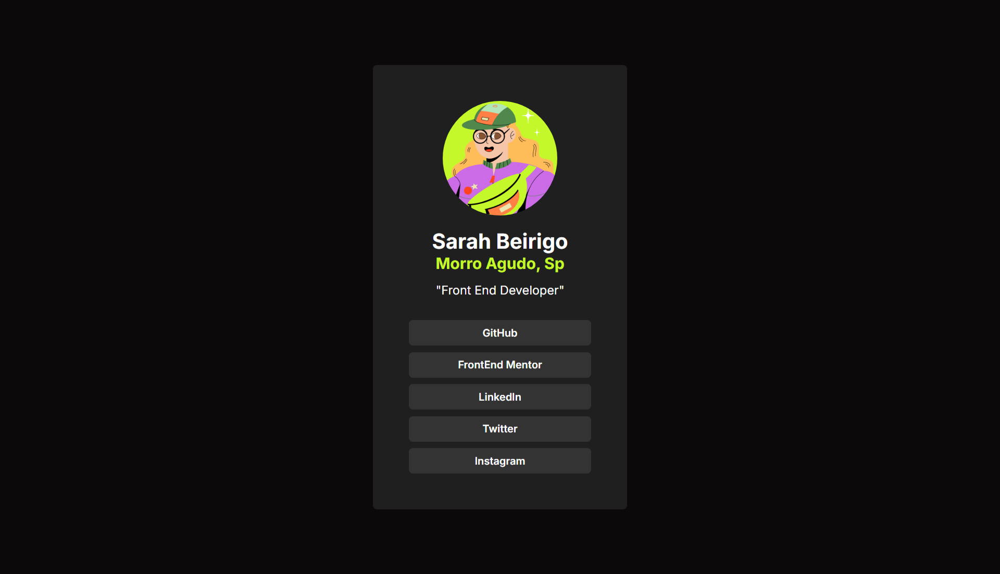

<p align="center"></p>


<h2 align="center">🏆 Frontend Mentor - Solução do desafio Social Links Profile</h2>


Esta é uma solução para o desafio [Social Links Profile no Frontend Mentor](https://www.frontendmentor.io/challenges/social-links-profile-UG32l9m6dQ). Os desafios do Frontend Mentor ajudam a aprimorar suas habilidades de codificação através da construção de projetos reais.

O **Social Links** é um site de página única que organiza todos os links de redes sociais de forma elegante e acessível. 
Utilizando apenas HTML e CSS, criando um layout simples e otimizado.



## 🔧 Tecnologias Utilizadas

- **HTML5** - Para estruturação do conteúdo
- **CSS3** - Para estilização e responsividade

## 🚀 Funcionalidades

- Interface simples com links diretos para as redes sociais
- Estilização minimalista com animações sutis para melhorar a experiência do usuário

### 🔗 Links
- [URL DESAFIO](https://sua-url-de-solucao.com)
- [MINHA SOLUÇAO](https://social-links-seven-eta.vercel.app/)

## 📂 Estrutura de Pastas

```bash
Social Links/
│
├── assets/                # Pasta de ativos
│   ├── style.css          # Arquivo principal de estilos
│   └── img/               # Pasta de imagens (previews e ícones)
│
├── index.html             # Página inicial
└── README.md              # Documentação do projeto
```

## 🖥️ Como Rodar o Projeto Localmente

1. Clone o repositório:

```bash
git clone https://github.com/sarahbeirigo/social-links.git
```

2. Navegue até o diretório do projeto:

```bash
cd social-links
```

3. Abra o arquivo `index.html` diretamente no navegador para visualizar o site.


### ✍️ Aprendizado

Neste projeto, aprofundei meus conhecimentos em:

- Desenvolvimento de estilzações em CSS
- Estruturação de conteúdo com HTML5 semântico


## 📝 Contato

Se você quiser saber mais sobre o projeto ou entrar em contato:

<a href = "mailto:sarahcbeirigo@gmail.com"></a>
<a href="https://www.linkedin.com/in/sarah-beirigo/" target="_blank"></a>

##
<p align="center">👩🏼‍💻 code by <a href="https://github.com/sarahbeirigo">Sarah Beirigo</a></p>

